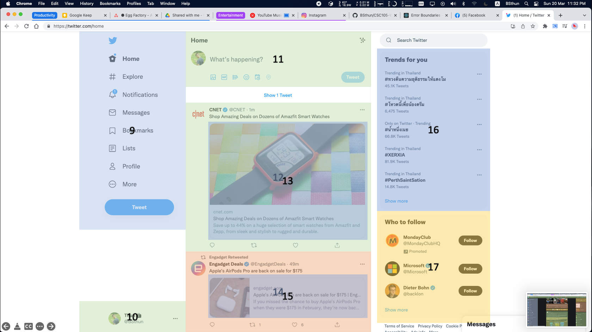
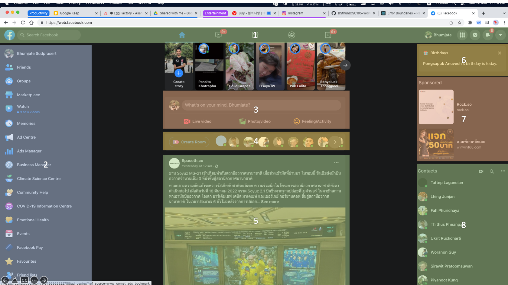
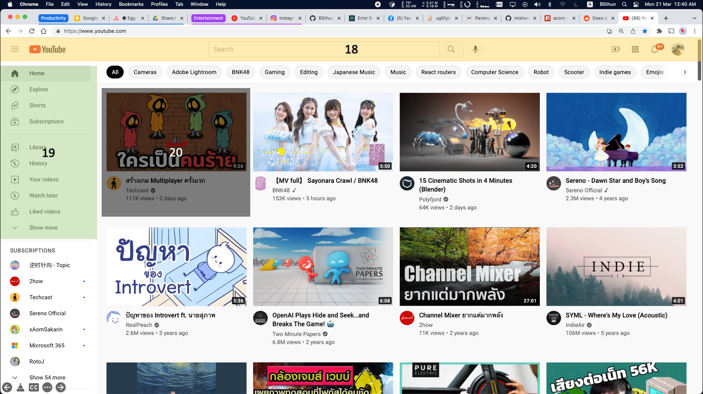
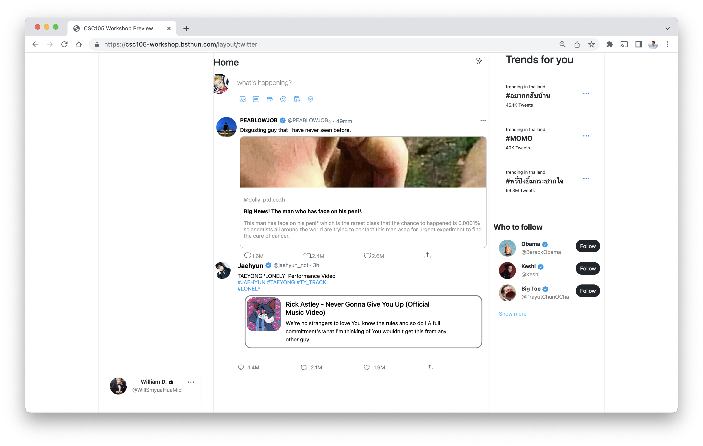
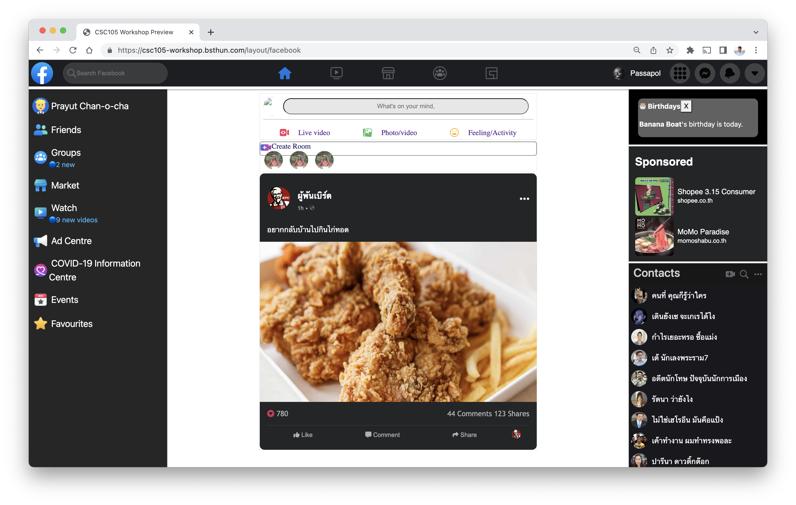
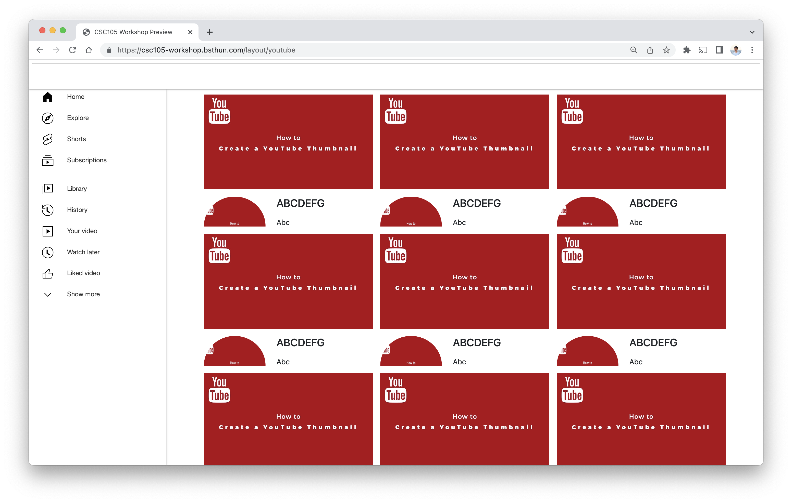

# Sublayout

A workshop designed to give attendees to create a clone component of famous web application using basic HTML/CSS. The core layout will use _iframe_ to combine all of each element together and showcast on the projector.

## Instruction

## Screenshot

